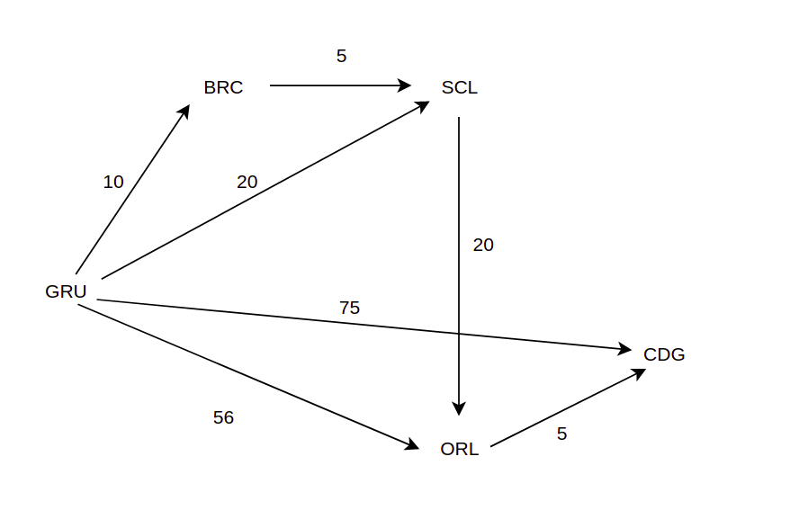
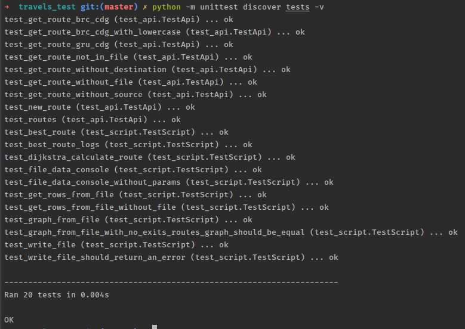
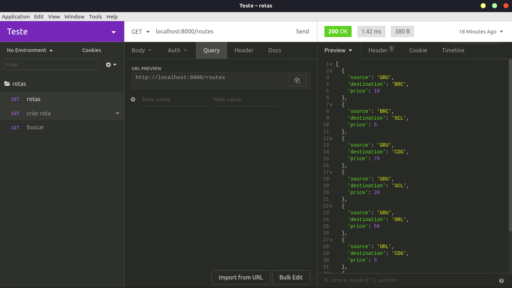
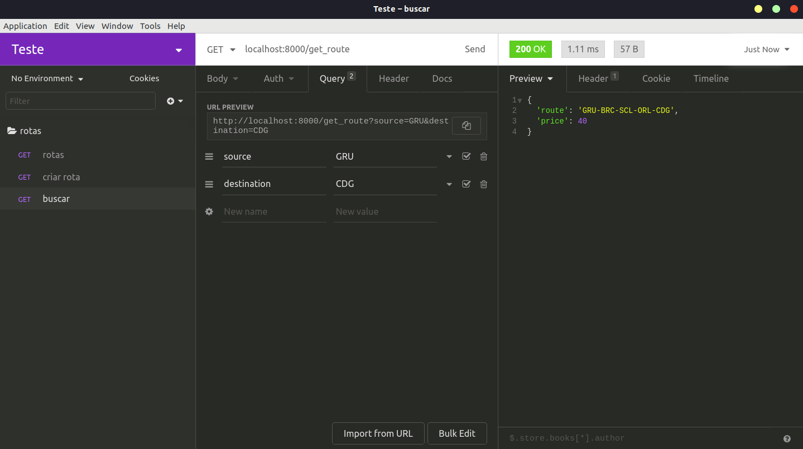
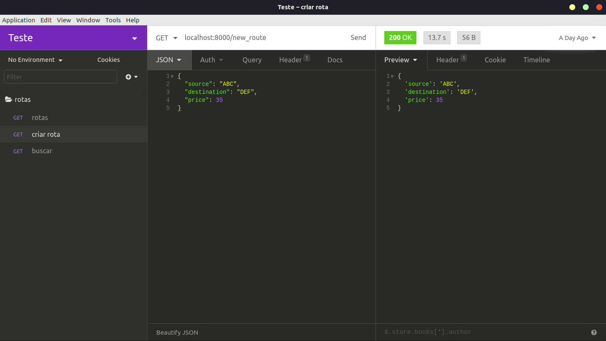

## TravelsTest
This software is responsible to retrieve, create show all available routes.



## Getting Started
These instructions will get you a copy of the project up and running on your local machine for development and testing purposes.

## Prerequisites

    python version [3.6.8]
    pyenv / virtualenv
    
## Installation
How to install the prerequisites:

`$ sudo apt-get install python3.6.8`

### How to create a virtualenv (using pyenv):
```
$ pyenv install [version]
$ pyenv global [version]
$ pyenv virtualenv [version] travels_test
$ pyenv activate travels_test
```

## Running the tests

To run the test suite, execute:

`$ python server.py`

You should see this message: `Server up and running on:  http://localhost:8000`
and on **another** shell instance run:
 
`(travels_test)$ python -m unittest discover tests -v`




## Running the Application

### On Shell

`$ python script.py input-file.csv`

Example:
  ```shell
  please enter the route: GRU-CDG
  best route: GRU - BRC - SCL - ORL - CDG > $40
  please enter the route: BRC-CDG
  best route: BRC - ORL > $30
  ```

### Running the Application on Insomnia/Postman**

run first:

`$ python server.py`

Then you should source the environment variables file(to persist on input-file.csv on root):

`(travels_test)$ source .travelsrc`

#### Get - routes

It will list all routes

`localhost:8000/routes/`



#### Get - route

`localhost:8000/get_route?source=<source>&destination=<destination>`



#### Post - new_route

to create a route, just post with the payload above.

`localhost:8000/new_route/`
```json
{
	"source": "ABC",
	"destination": "DEF",
	"price": 35
}
```

